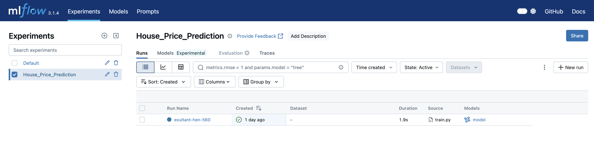
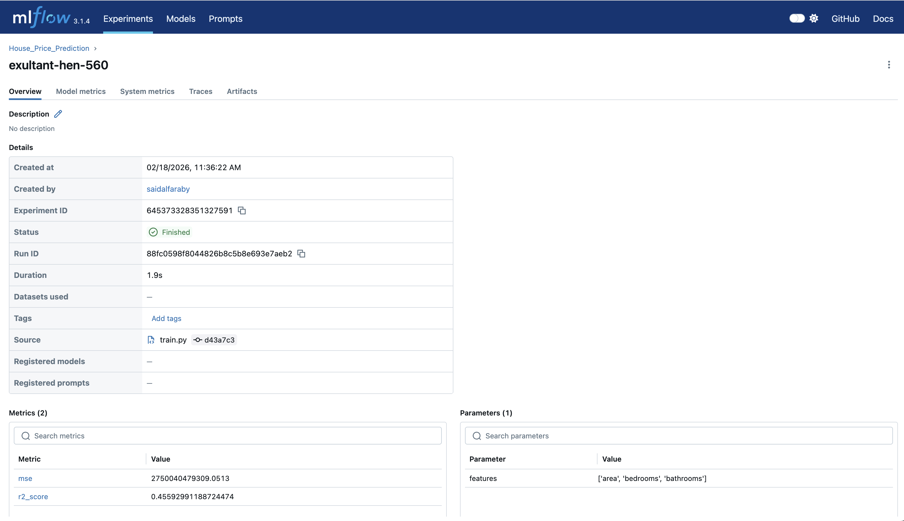
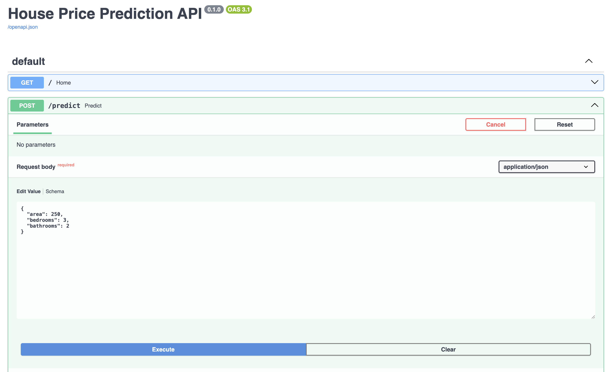
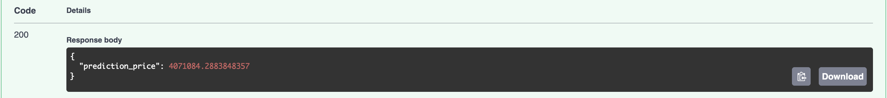
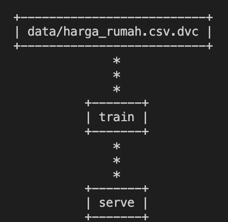

# End-to-End Machine Learning Pipeline


Tujuan utama kita adalah membangun **jalur pipa (pipeline)** yang otomatis. Dengan struktur ini, ketika ada data baru (Cycle 2), proses dari *training* hingga *deployment* dapat berjalan dengan intervensi manual yang minim.

## 1. Persiapan Environment (Conda)

Gunakan **Conda** untuk membuat lingkungan terisolasi agar tidak mengganggu pustaka lain di sistem Anda.

```bash
# Membuat environment baru dengan python 3.9
conda create -n mlops-tutorial python=3.9 -y
conda activate mlops-tutorial

# Install library utama melalui conda dan pip
conda install pandas scikit-learn -y
pip install dvc dvc-gdrive mlflow fastapi uvicorn
```


## 2. Data Ingestion & Versioning
TODO:
- Nanti cycle 2 push data ke Google Drive


Kita mulai dengan mensinkronkan Git (untuk kode) dan DVC (untuk data).

```bash
git init
dvc init

# Commit inisialisasi DVC ke Git
git add .dvc .gitignore
git commit -m "Initialize DVC"
```

### Unduh Data dari Kaggle

Alih-alih membuat data manual, kita akan mengambil data "House Prices" dari benchmark publik. Ini mensimulasikan tahap awal pipeline di mana data diambil dari sumber eksternal.

1. Install `kagglehub`

    Kita akan menggunakan `kagglehub` untuk mengunduh dataset secara terprogram.

    ```bash
    pip install kagglehub
    ```

2. Skrip Data Ingestion

    Simpan kode berikut sebagai `src/generate_data.py`. Skrip ini akan mengunduh data, mengambil kolom yang kita butuhkan, dan menyimpannya ke folder `data/`.

    ```python
    import kagglehub
    import pandas as pd
    import os
    import shutil

    def ingest_data():
        print("Mengunduh dataset dari Kaggle...")
        # Mengunduh versi terbaru dataset House Prices
        path = kagglehub.dataset_download("yasserh/housing-prices-dataset")
        
        # Dataset biasanya berisi beberapa file, kita cari file CSV-nya
        downloaded_file = os.path.join(path, "Housing.csv")
        
        # Pastikan folder tujuan ada
        os.makedirs('data', exist_ok=True)
        target_path = 'data/harga_rumah.csv'
        
        # Copy file ke folder proyek kita
        shutil.copy(downloaded_file, target_path)
        print(f"Dataset berhasil disimpan di {target_path}")

        # Intip data sedikit
        df = pd.read_csv(target_path)
        print("\nPreview Data:")
        print(df[['area', 'price']].head())

    if __name__ == "__main__":
        ingest_data()
    ```

    Jalankan di terminal:
    ```bash
    python src/generate_data.py
    ```

### Versi-kan Data dengan DVC (Public Benchmark)

Karena file data bisa sangat besar dan bersifat "asli", sangat penting untuk tidak memasukkannya ke Git secara langsung.

```bash
# Tambahkan ke DVC
dvc add data/harga_rumah.csv

# Hubungkan ke Git
git add data/harga_rumah.csv.dvc data/.gitignore
git commit -m "Ingest House Price dataset from Kaggle"    
git tag -a "v1.0" -m "Dataset versi 1.0"
```

### Otomasi: Definisi Pipeline (`dvc.yaml`)
    
Agar proses ini otomatis, kita menggunakan **DVC Pipelines**. File ini menghubungkan ketergantungan (*dependencies*) antara data dan kode latihan.

Buat file `dvc.yaml` di root directory:

```yaml
stages:
train:
    cmd: python src/train.py
    deps:
    - data/harga_rumah.csv
    - src/train.py
    outs:
    - models/model.pkl
    metrics:
    - metrics.json:
        cache: false
```

* **deps**: Jika `data/harga_rumah.csv` berubah, DVC akan mendeteksi bahwa tahap `train` perlu dijalankan ulang.
* **outs**: File model yang dihasilkan akan dilacak secara otomatis.
* **metrics**: Hasil evaluasi model disimpan dalam format JSON untuk perbandingan antar versi.


## 3. Training & Tracking dengan MLflow

<!-- Cycle 1: Training & Tracking dengan MLflow -->

Setelah data tersedia di `data/harga_rumah.csv`, langkah selanjutnya adalah melatih model. Kita akan menggunakan **Linear Regression** sederhana, namun dengan standar engineering yang mencatat setiap eksperimen secara otomatis.

### 1. Persiapan Script Training

Pastikan Anda berada di dalam environment Conda yang telah dibuat sebelumnya:

```bash
conda activate mlops-tutorial
pip install mlflow
```

Simpan kode di bawah ini sebagai `src/train.py`. Skrip ini melakukan pemrosesan data sederhana, melatih model, mencatat metrik ke file JSON (untuk DVC), dan mengirim log ke MLflow.

```python
import pandas as pd
import json
import pickle
import os
import mlflow
import mlflow.sklearn
from sklearn.model_selection import train_test_split
from sklearn.linear_model import LinearRegression
from sklearn.metrics import mean_squared_error, r2_score

def train():
    # 1. Load Data
    df = pd.read_csv('data/harga_rumah.csv')
    
    # Pilih fitur sederhana untuk fokus pada engineering
    X = df[['area', 'bedrooms', 'bathrooms']]
    y = df['price']
    
    X_train, X_test, y_train, y_test = train_test_split(X, y, test_size=0.2, random_state=42)
    
    # 2. Inisialisasi MLflow Tracking
    mlflow.set_experiment("House_Price_Prediction")
    
    with mlflow.start_run():
        # 3. Training
        model = LinearRegression()
        model.fit(X_train, y_train)
        
        # 4. Evaluasi
        predictions = model.predict(X_test)
        mse = mean_squared_error(y_test, predictions)
        r2 = r2_score(y_test, predictions)
        
        print(f"Model Trained. R2 Score: {r2:.4f}")
        
        # 5. Log ke MLflow
        mlflow.log_param("features", ["area", "bedrooms", "bathrooms"])
        mlflow.log_metric("mse", mse)
        mlflow.log_metric("r2_score", r2)
        mlflow.sklearn.log_model(model, "model")
        
        # 6. Simpan Model & Metrik untuk DVC
        os.makedirs('models', exist_ok=True)
        with open('models/model.pkl', 'wb') as f:
            pickle.dump(model, f)
            
        metrics = {
            "mse": mse,
            "r2_score": r2
        }
        with open('metrics.json', 'w') as f:
            json.dump(metrics, f)

if __name__ == "__main__":
    train()
```

### 2. Menjalankan Pipeline dengan DVC
Alih-alih menjalankan `python src/train.py`, kita akan menggunakan perintah DVC. Mengapa? Agar DVC mencatat bahwa file model dan metrik tersebut berasal dari versi data yang saat ini kita gunakan.

```bash
dvc repro
```

Perintah `dvc repro` akan membaca `dvc.yaml`, melihat apakah ada perubahan pada data atau script, lalu menjalankan `src/train.py` jika diperlukan.

Untuk melihat pipeline DVC dalam graph (DAG) gunakan perintah di bawah ini:

```bash
dvc dag
```

<center></center>


### 3. Melihat Hasil di Dashboard MLflow
MLflow menyediakan antarmuka web yang sangat cantik untuk membandingkan hasil eksperimen. Jalankan perintah ini di terminal:

```bash
mlflow ui
```

Buka browser Anda dan akses http://127.0.0.1:5000. Anda akan melihat daftar eksperimen, metrik $R^2$, dan parameter yang baru saja dijalankan.





### 4. Versi-kan Model dan Metrik
Setelah menjalankan `dvc repro`, DVC akan memperbarui sebuah file penting bernama `dvc.lock`. File inilah "sidik jari" asli dari model Anda.

```bash
# Simpan perubahan ke Git
git add metrics.json dvc.yaml dvc.lock
git commit -m "Train initial model and log metrics"
```

---

### Apa yang kita dapatkan sekarang?
1. **Reproduksibilitas:** Siapapun yang punya kode Anda bisa menjalankan `dvc repro` dan mendapatkan hasil yang sama.
2. **Observabilitas:** Anda punya dashboard (MLflow) untuk memantau kualitas model.
3. **Data-Model Link:** DVC memastikan model di folder `models/` selalu sinkron dengan data di folder `data/`.


## 4. Deployment API

Cycle 1: Deployment dengan FastAPI

Pada tahap ini, kita akan membungkus model Linear Regression yang sudah dilatih ke dalam sebuah layanan web (API).

### 1. Persiapan Library
Pastikan environment Conda Anda sudah memiliki library untuk web server:

```bash
pip install fastapi uvicorn
```

### 2. Membuat Script API Server
Simpan kode berikut sebagai `app/main.py`. Kode ini bertugas memuat model `.pkl` dan menyediakan *endpoint* untuk prediksi.

```python
from fastapi import FastAPI
import pickle
import pandas as pd
from pydantic import BaseModel

# 1. Inisialisasi App
app = FastAPI(title="House Price Prediction API")

# 2. Load Model yang dihasilkan DVC
with open('models/model.pkl', 'rb') as f:
    model = pickle.load(f)

# Definisi format input data
class HouseFeatures(BaseModel):
    area: int
    bedrooms: int
    bathrooms: int

@app.get("/")
def home():
    return {"message": "API Prediksi Harga Rumah aktif!"}

@app.post("/predict")
def predict(features: HouseFeatures):
    # Ubah input menjadi DataFrame (karena model dilatih dengan pandas)
    data = pd.DataFrame([features.dict()])
    
    # Melakukan prediksi
    prediction = model.predict(data)
    
    return {
        "prediction_price": float(prediction[0])
    }
```

### 3. Menjalankan Server Lokal
Jalankan perintah ini di terminal untuk menyalakan API:

```bash
uvicorn app.main:app --reload
```

### 4. Testing API (Dokumentasi Otomatis)
Salah satu fitur terbaik FastAPI adalah Swagger UI. Tanpa perlu membuat UI, Anda bisa mengetes API Anda langsung:

1. Buka browser dan akses: `http://127.0.0.1:8000/docs`
2. Cari endpoint `POST /predict`.
3. Klik **"Try it out"**, masukkan data area/kamar, dan klik **Execute**.
4. Lihat hasilnya di bagian **Response Body**.

Misalnya kita bisa mengisi parameter `area`, `bedrooms`, dan `bathrooms` seperti pada gambar di bawah ini:



Kemudian setelah `Execute` prediksi harga rumah dapat dilihat di bagian `Response Body` seperti gambar di bawah ini:



### 5. Menghubungkan ke DVC Pipeline
Kita ingin agar DVC juga tahu bahwa `app/main.py` adalah bagian dari sistem kita. Tambahkan stage baru di `dvc.yaml`:

```yaml
stages:
    ...
    ...
    serve:
        cmd: uvicorn app.main:app --host 0.0.0.0 --port 8000
        deps:
        - app/main.py
        - models/model.pkl
```

Sehingga gambar `dvc dag` harusnya menjadi seperti ini:

Untuk melihat pipeline DVC dalam graph (DAG) gunakan perintah di bawah ini:

<center></center>

## 5. Dockerization
Sekarang setelah data ter-versi, eksperimen tercatat di MLflow, dan API sudah siap di FastAPI, masalah terakhir adalah: **"It works on my machine"**.

Kita perlu memastikan API ini bisa jalan di mana saja (laptop teman, server cloud, atau production) tanpa pusing dengan versi library atau environment Conda.

**Docker** adalah standar industri untuk membungkus aplikasi agar bisa berjalan di mana saja tanpa masalah "versi library beda" atau "di laptop saya bisa". Dalam MLOps, Docker memastikan bahwa model yang Anda latih di environment development akan berjalan identik saat di-*deploy* ke server produksi.

Setelah API siap, kita akan membungkusnya ke dalam sebuah **Container**. Bayangkan Docker sebagai peti kemas standar yang bisa diangkut oleh kapal apa saja, apa pun isinya.

Pertama-tama silakan unduh dan install Docker Desktop sesuai sistem operasi Anda:
* [Docker Desktop for Windows](https://www.docker.com/products/docker-desktop/) (Pilih yang mendukung **WSL 2**).
* [Docker Desktop for Mac](https://www.docker.com/products/docker-desktop/) (Pilih **Apple Chip** jika Anda menggunakan M1/M2/M3).
* [Docker for Linux](https://docs.docker.com/desktop/install/linux-install/): Gunakan perintah `sudo apt-get install docker-ce`.

### 1. Membuat file `requirements.txt`

Sebelum membuat Docker image, kita perlu daftar *library* yang harus diinstal di dalam container. Jalankan perintah ini untuk membuat file otomatis:

```bash
pip list --format=freeze > requirements.txt
```

### 2. Membuat Dockerfile
Buat file bernama `Dockerfile` (tanpa ekstensi) di root directory proyek Anda. File ini berisi instruksi bagaimana cara membangun "rumah" untuk API kita.

```Dockerfile
# 1. Gunakan image dasar Python yang ringan
FROM python:3.9-slim

# 2. Tentukan directory kerja di dalam container
WORKDIR /app

# 3. Copy file requirements dan instal library
COPY requirements.txt .
RUN pip install --no-cache-dir -r requirements.txt

# 4. Copy folder yang dibutuhkan (app dan models)
COPY ./app ./app
COPY ./models ./models

# 5. Expose port yang digunakan FastAPI
EXPOSE 8000

# 6. Jalankan server saat container dimulai
CMD ["uvicorn", "app.main:app", "--host", "0.0.0.0", "--port", "8000"]
```

### 3. Membuat `.dockerignore`
Agar Docker image kita tidak berat, kita harus mengabaikan file yang tidak perlu (seperti data mentah yang sangat besar atau folder `.git`). Buat file `.dockerignore`:

```text
data/
.git/
.dvc/
.ipynb_checkpoints/
__pycache__/
```

### 4. Build dan Run Container
Sekarang, mari kita bangun (*build*) image tersebut dan menjalankannya.

```bash
# Membangun image dengan nama 'house-api'
docker build -t house-api .

# Menjalankan container
docker run -p 8000:8000 house-api
```

Jika semua berjalan lancar, maka kita bisa mengunjungi link di `http://0.0.0.0:8000/docs` lalu melihat tampilan yang sama seperti sebelumnya.